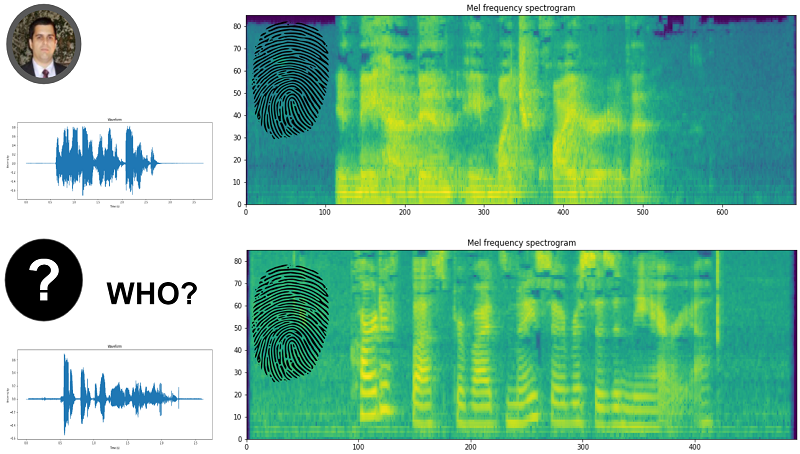
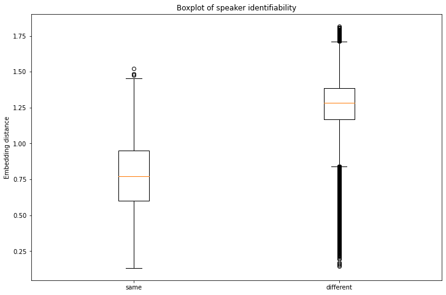
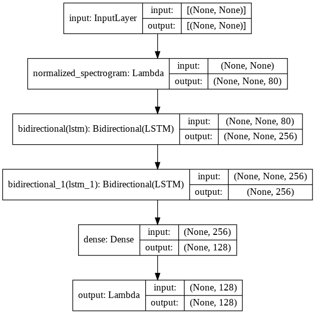

# SpeechIdentity

## Identity verification from speech

---

This repository contains source code to train and use speech embedding models in order to identify if two audio samples come from the same person or different users.



You may also want to check the related [Data Science post](https://medium.com/@douglas125/a-speech-embedding-model-for-speaker-recognition-42b9943cfb99).

## How to use this repo

### Installation

**Environment:** I recommend setting up a separate environment to run this code. Install `requirements.txt` with conda and `pip_requirements.txt` with pip (basically, tensorflow dependencies).

**Data:** This repo uses Mozilla [Common Voice dataset](https://commonvoice.mozilla.org/en/datasets). I suggest downloading the English corpus (cv-corpus-7.0-2021-07-21-en.tar.gz) into the `data` folder.

### Inference with pretrained model

Import TensorFlow libraries and files with auxiliary functions:

```
import os
import tensorflow as tf
import tensorflow_io as tfio

import train_speech_id_model
```

Load the model and perform inference on a file:

```
model = tf.keras.models.load_model('speech-id-model-110')
cur_data = tfio.audio.AudioIOTensor(file)
audio_data = cur_data.to_tensor()[:, 0]
# set batch size to 1, extract first element
audio_embedding = model.predict(
	tf.expand_dims(audio_data, axis=0)
)[0]
```

Note that the expected sampling rate is 48 kHz, used in the training data. An example is provided in the script `quick_inference.py`, which loads and compares the embeddings of all MP3 files in the current folder. The output should be:

```
Comparing ['sample_1a.mp3', 'sample_1b.mp3', 'sample_2.mp3']
Processing sample_1a.mp3 with sample rate of 48000
Processing sample_1b.mp3 with sample rate of 48000
Processing sample_2.mp3 with sample rate of 48000
sample_1a.mp3 and sample_1b.mp3: Same person: 0.7631306052207947
sample_1a.mp3 and sample_2.mp3: Different people: 1.1691123247146606
sample_1b.mp3 and sample_2.mp3: Different people: 1.3037692308425903
```

This model achieves specificity = 98.3% and sensitivity = 60.2% using a threshold level of 0.83. It is very simple to tune the value to an application specific needs - the lower the threshold, the more similar two audios need to be (in embedding space) to be considered "same" person.



Embedding distance of 2 audios given that a speaker is the same or different (English - test). Note that the median distance is significantly lower when the speaker is the same. Although there are cases where the distance for different speakers is low, those are rare and can be considered outliers in the distribution.


### Training

**Download data**: Go to Mozilla [Common Voice dataset](https://commonvoice.mozilla.org/en/datasets), download the language of your interest and place it in the `data` folder. The results presented here were obtained using the English corpus, version 7 - `cv-corpus-7.0-2021-07-21-en.tar.gz`.

**Prepare tfrecords**: Run the script `python create_audio_tfrecords.py data` to process all `.tar` and `.tar.gz` in the `data` folder in order to prepare TFRecords files (train/dev/test). *Note: I had some issues when preparing the TFRecords in AWS EC2 instance with GPU. If this happens, try using a CPU only instance.*

In the case of the English corpus, the generated files are:

- cv-corpus-7.0-2021-07-21-en.tar.gz_dev.tfrecords.gzip, 701 Mb
- cv-corpus-7.0-2021-07-21-en.tar.gz_test.tfrecords.gzip, 693 Mb
- cv-corpus-7.0-2021-07-21-en.tar.gz_train.tfrecords.gzip, 30.8 Gb

Since the English corpus is so large, we did not worry about adding extra languages to it. If that is something necessary for you, note that every client_id restarts from 0 in each TFRecords file and this needs to be corrected to group them together, i.e., it is necessary to assign each user a unique id.

**Train model**: Run the script `python train_speech_id_model.py` to use the train TFRecords file in the `data` folder to learn speech embeddings. If more than one is available, the script will pick only one. Checkpoints will be saved in the `temp` folder if the loss decreased.

## What is in the files

**create_audio_tfrecords.py**:

- class AudioTarReader, with methods that enable reading the tar files in the Common Voice dataset;
- class PersonIdAudio, with methods that enable reading and writing TFRecords files.

**train_speech_id_model.py**:

- def BaseSpeechEmbeddingModel, which defines the embedding model;
- code to train this model using triplet loss

### Model architecture

The proposed model takes as input the audio data in time domain, computes the mel-frequency spectrogram, extracts features with a stack of 2 LSTM layers followed by a Dense layer that outputs the audio embeddings. The number of trainable parameters is 641k. The output is L2-normalized, which is a requirement of the Triplet loss.




## References


- Librosa - https://librosa.org/doc/latest/index.html
- TensorFlow IO Audio - https://www.tensorflow.org/io/api_docs/python/tfio/audio
- TensorFlow Addons Losses: TripletSemiHardLoss - https://www.tensorflow.org/addons/tutorials/losses_triplet
- FaceNet: A Unified Embedding for Face Recognition and Clustering - https://arxiv.org/pdf/1503.03832.pdf
